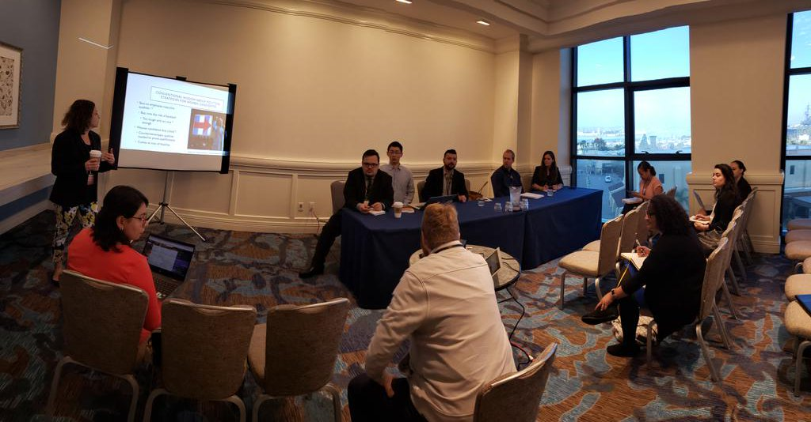
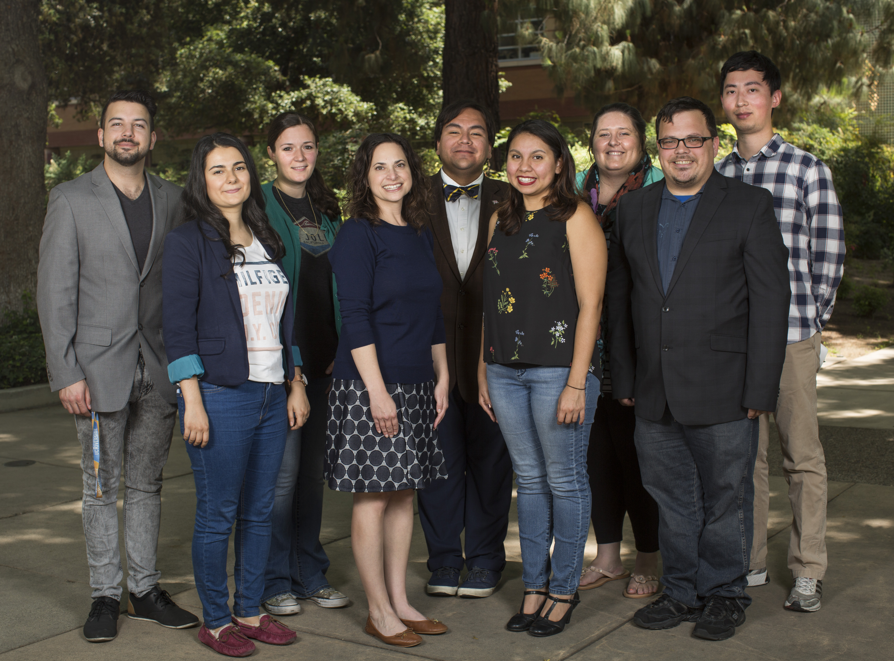

---
---

<link rel="stylesheet" href="styles.css" type="text/css">

#

### Spring 2019
#### Manager: Michelangelo Landgrave
#### Teams present research at WPSA.

#### Teams present research at MPSA.

#

### Winter 2019
#### Manager: Michelangelo Landgrave
#### Teams organize a Junior Scholar Symposium at MPSA 2019.
#### Teams organize a panel at WPSA 2019.

#

### Fall 2018
#### Manager: Stephanie L. DeMora

#

### Summer 2018
#### Manager: Sierra Graves

#

### Spring 2018
#### Manager: Sierra Graves
#### First Gender Lab meeting begins
#### Teams are created!

#

### Winter 2018
#### Dr. Jennifer Merolla's Women and the American Political Process course (POSC 259) is taught.
#### Ideas for first round of teams are created.

