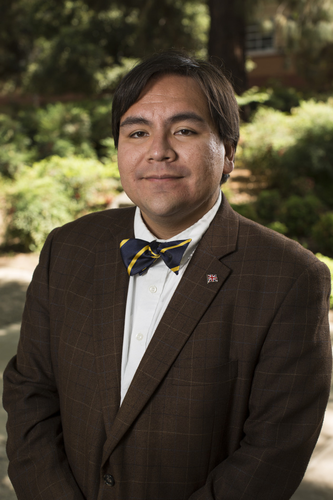

---
---

<link rel="stylesheet" href="styles.css" type="text/css">

#

\

#

#

\

#

#

#

#

#

#

#### [Michelangelo Landgrave](https://www.michelangelo.mx/)

\

Michelangelo Landgrave is a political science doctoral candidate at the University of California, Riverside. His research focuses on local politics and policy. His research has appeared in the Washington Post, The Hill, Vox, and other news outlets. He holds a master’s degree in Economics from California State University, Long Beach. He is a doctoral fellow with the Mexican National Council of Science and Technology (Conacyt).

\

\

\

\

\

\

\

\

\

#### Adriana Ninci

\

\

\

\

\

\

\

\

\

\

\

\

\

\

\
\

\

\

\

\

\

#

#

#

#

#

#

#

 

This website was created and is maintained by [Stephanie L. DeMora](https://www.stephaniedemora.com/)

