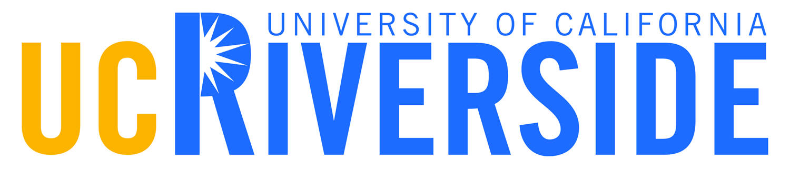

---
---

<link rel="stylesheet" href="styles.css" type="text/css">

#

#

###

###

###

###

### We are the Gender Laboratory in the Department of [Political Science at the University of California, Riverside](https://politicalscience.ucr.edu/)! 

###

###

#### Our lab is comprised of several teams which work on individual research projects relating to gender and politics. Together, we collaborate, brainstorm, and share resources regularly.

####

####

#### Please visit our [projects](https://ucr-gender-lab.github.io/projects.html) tab for more information about our research groups and our progress.

####

####

#### Our current lab director is: [Dr. Jennifer Merolla](https://jennifermerollaphd.wordpress.com/).

#

#

#

#

#

#

#

#

#

#

#

#

#

#

#

#

#

#

#

#

#

#

#

#

#

#

#

#

#

#

#

#

#

#

#

#

#

#

#

#

#

#

#

#

#

#

#

#

#

#

#

#

#

#

#

#

This website was created and is maintained by [Stephanie L. DeMora](https://www.stephaniedemora.com/)

