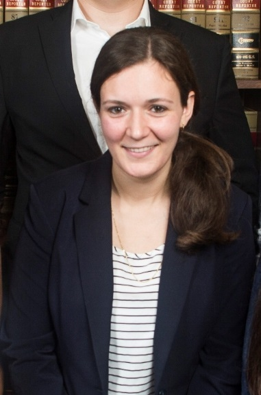

---
---

<link rel="stylesheet" href="styles.css" type="text/css">

#

#

#

#

#

#

#

#

#### [John Burnett](https://johnbur.net/)

\

John is a PhD student at the University of California, Riverside. His recent research focuses on how technology and pathology can influence political predispositions.

\

\

\

\

\

\

\

#### [Stephanie L. DeMora](https://www.stephaniedemora.com)

\

Stephanie is a PhD student in the Political Science department, working under Dr. Loren Collingwood. Her sub-fields at UCR are Mass Political Behavior and American Politics. Additionally,  she holds a B.A. in International Relations and Middle Eastern Studies, as well as an M.A. in Political Science from the University of Arkansas. Her previous research includes the socialization of refugee women in the United States, discrimination against religious communities, the effects of identity-based rhetoric.

\

\

\

\

\

\

\

\

\

\

#### [Stephen Omar El-Khatib](https://www.stephenelk.com/)

\

Stephen is a doctoral student researcher at the University of California, Riverside, studying political science. His research primarily focuses on the politics of race, immigration, and ethnicity through the lenses of behavioral and comparative politics.  More specifically, his existing and continued work evaluates discrimination and public policy. His research is primarily inspired and driven by his experiences as a bi-racial, first-generation Arab-American.

\

\

\

\

\

\

\

#### Sierra Graves

\

\

\

\

\

\

\

\

\

\

\

\

\

\

\

\

\

#### [Michelangelo Landgrave](https://michelangelolandgrave.wordpress.com/)

\

Michelangelo Landgrave is a political science doctoral student at the University of California, Riverside. His research focuses on local politics and policy. His research has appeared in the Washington Post, The Hill, Vox, and other news outlets. He holds a master’s degree in Economics from California State University, Long Beach. He is a doctoral fellow with the Mexican National Council of Science and Technology (Conacyt).

\

\

\

\

\

\

\

\

\

#### Morgan Liedke

\

\

\

\

\

\

\

\

\

#### [Christian Lindke](https://www.christianlindke.com/)

\

Christian Lindke is a Doctoral student in Political Science at the University of California, Riverside and the Program Director of the Arsalyn Program of Ludwick Family Foundation. Christian earned his Master of Science in Business Administration with a focus on Marketing and Market Research at California State Polytechnic, Pomona at their Graduate School of Business. Christian's current research interests are political polarization, transmission of affective polarization between generations, and how parenting interacts with politics.

\

\

\

\

\

\

\

#### Sean Long

\

Sean Long is a PhD student in Political Science. His primary interests revolve around social identity, political communications, and the media, as well as quantitative methods and text analysis. His non-lab related research has focused on political extremism, local discrimination, and immigration. He also holds an MA in American Government from Georgetown University and a BA in philosophy from Reed College.

\

\

\

\

\

\

\

\

\

#### Arielle Manganiello

\

\

\

#### [Jenn Merolla](https://jennifermerollaphd.wordpress.com/)

\

\

I am a Professor in the Department of Political Science at the University of California, Riverside. I specialize in the study of Political Behavior. My research focuses on how the information environment and contexts of threat shape attitudes and political behavior among the public. I am also the field editor in American Behavior for the Journal of Politics.

\

\

\

\

\

\

\

\

\

#### Adriana Ninci

\

\

\

\

\

#### [Maricruz Ariana Osorio](http://www.mosorio.info/)

Maricruz Ariana Osorio is a graduate student at the University of California, Riverside. She is proud to be in the company of McNair Fellows, Eugene Cota-Robles Fellows, and APSA MFP Fellows. She has published on the topics of race and Latinx politics. Her current research projects focus on immigration, refugees, political psychology, and gender. Maricruz is also part of the duo that make up People of Color Also Know Stuff. 

\

\

\

\

\

\

\

\

\

#### [Beyza Han Tuncez](https://politicalscience.ucr.edu/wp-content/uploads/2014/06/academic-cv.pdf)

\

\

\

\

\

\

\

\

\

\

\

\

\

\

\

\

\

#### Ding Wang

\

\

\

#

#

#

#

#

#

#

 

This website was created and is maintained by [Stephanie L. DeMora](https://www.stephaniedemora.com/)

